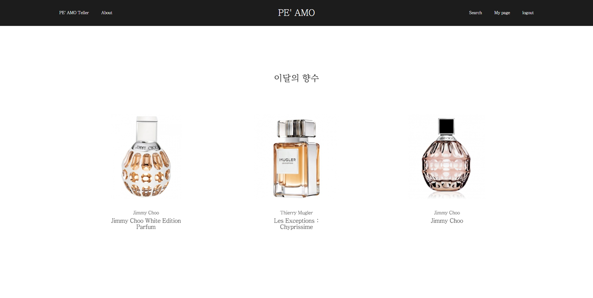

# PE' AMO [ 당신의 취향을 찾아드립니다 ]

> ***Pe***rfume(향수) 과 TI ***Amo***(사랑해) 의 결합
>
> 주제 : 빅데이터 기반 향수 추천 사이트
>
> 개발 기간 : 2021.08.30 ~ 2021.10.08 [7주]


## 목차

[0. 팀소개](#0. 팀소개)

[1. 서비스 소개](#1. 서비스 소개)

[2. 기술스택](#2. 기술스택)

[3. 추천 알고리즘](#3. 추천 알고리즘)

[4. 아키텍처](#4. 아키텍처)

[5. 사이트 레이이웃 및 디자인](#5. 사이트 레이아웃 및 디자인)


## 0. 팀소개

> 팀원들의 장점이 확실했고 그 장점들이 잘 어우러진 팀이었습니다. 열정이 넘치는 권오우 팀원, 어려운 선택의 갈림길에서 항상 옳은 선택을 하도록 리드하는 서예리 팀원, 다른 팀원들의 의견을 잘 정리해주는 신지수 팀원, 깔끔하게 코드를 리팩토링 해주는 송상민 팀원, 꼼꼼하게 새로운 기술을 정리해주는 윤지영 팀원 그리고 프론트와 백엔드를 가리지 않아 소통의 창구가 되어준 장현웅 팀원까지 어느 한 명 서로의 부족함을 탓하지 않고 그 부족함을 채워나갈 수 있도록 완벽에 가까운 협력을 했던 팀이었습니다.


- 권오우(FE) : 빅데이터 추천 알고리즘 구현 / teller 페이지 구현 / 사이트 배포 및 CI/CD 작업
- 서예리(FE) : main, search, about 페이지 구현 / UCC 제작 / 중간 발표
- 송상민(FE) :  social login/logout, detail, error, loading 페이지 구현 / Redux를 이용한 상태 관리
- 신지수(BE) : 향수 리스트, 향수 검색, 향수 세부 정보, 이달의 향수 구현 / 최종 발표
- 윤지영(BE) : social login/logout, 마이페이지, 향수 좋아요, 사용자 취향 탐색 구현 / 데이터 크롤링 및 DB 관리
- 장현웅(BE) : 빅데이터 추천 알고리즘 구현 / 사용자 취향 탐색 구현 / 데이터 크롤링 및 DB 관리 / AWS RDS
- 공통 작업 : 프로젝트 기획 및 자료 정리 / 발표 자료 준비 / 중간 발표


## 1. 서비스 소개

> 빅데이터를 기반으로 향수를 추천해주는 사이트


### 1.1 기획 배경

코로나로 인한 정부 방역지침에 따라 백화점에서는 시식, 시음, 시향 등을 금지했으며, 이에 따라 화장품 매출은 감소했지만 향수 매출은 오히려 늘어났다. 업계에서는 화장 대신 자신을 표현할 수 있는 수단으로 향수가 각광받고 있는 것으로 보고 있다. 이러한 흐름에 발 맞추어 사용자에게 어울리는 향수를 추천해주는 사이트의 필요성을 느끼고 PE' AMO 프로젝트를 기획하게 되었다.

 

### 1.2 주요 타겟

#### 1.2.1 향수에 대해 잘 모르는 사회 초년생

- 향수를 처음 구매하려는 사회 초년생에게는 많은 진입 장벽이 있다. 우리 사이트에서는 이런 진입 장벽을 허물고 간단한 질문을 통해 사용자의 선호도를 파악하고 그에 맞는 향수를 추천해준다.

#### 1.2.2 본인이 사용했던 향수와 비슷한 향을 찾는 구매자

- 향수는 같은 향을 낸다고 하더라도 포함된 노트들에 따라 전혀 다른 향기가 난다. 이런 문제로 고민을 하는 구매자들에게 자신이 사용했던 향수를 검색하면 그 향수와 가장 비슷한 향수를 찾아서 추천해준다.

  

### 1.3 주요 기능

#### 1.3.1 취'향' 찾기


- 향수를 처음 접하는 사용자들 위한 향수 추천 기능으로 총 3가지의 향수를 추천하여 준다.
- 6개의 간단한 질문을 통해 필터링된 향수들 중 '좋아요' 수가 가장 높은 향수 하나를 뽑아낸 후, 이 향수와 가장 유사도가 높은 향수 2개를 CBF(Content Based Filtering) 추천 알고리즘을 이용하여 추출한다. 이렇게 선택된 3개의 향수를 사용자에게 어울리는 향수로 추천하여 준다.

#### 1.3.2 향수 검색


- 이미 사용하고 있는 향수가 있고 기존 사용한 향수와 유사한 향수를 찾고 싶은 사용자를 위한 기능이다.
- 약 40,000 개의 향수를 검색 및 상세 정보를 확인할 수 있다.
- 향수 이름으로 검색을 하면 해당 향수를 찾을 수 있고, 이미지를 클릭 시 해당 향수의 상세 모달 창이 뜨게 된다. 이 모달 창에서 향수의 상세 정보(note 정보, 성별 등)와 함께 CBF(Content Based Filtering) 추천 알고리즘을 이용하여 이 향수와 유사도가 가장 높은 2개의 향수를 보여준다.


## 2. 기술스택

### 2.1 백엔드

- Spring Boot
- My SQL
- Amazon RDS


### 2.2 프론트엔드

- React.js
- Redux
- Material UI


### 2.3 데이터 수집 및 처리

- Pandas
- Numpy
- Scikit-learn


### 2.4 배포

- AWS EC2
- Jenkins
- Docker


### 2.5 협업 Tool

- Git

- Notion

- Jira


## 3. 추천 알고리즘

> 추천 알고리즘의 대표적인 두 가지 방식인 CBF(Content Based Filtering) 방식과 CF(Collaborative Filtering) 방식 중 CBF 방식을 사용


### 3.1 데이터 가공

#### 3.1.1 향수 데이터

```json
[
    {
        'id': 향수 id(int),
        'imgurl': 향수 imgurl(string),
        'brand': 브랜드 id(id),
        'name': 향수 이름(string),
        'gender': 향수 타겟 성별(int),
        'top_notes': [note id](int list),
		'middle_notes': [note id](int list),
		'base_notes': [note id](int list),
		'categories': [categort id](int, list)
    },
	...
]
```

#### 3.1.2 데이터 가공 

```python
# row : 향수 id / column : 향수 노트 id 인 DataFrame 생성
df = pd.DataFrame(columns=note_nums, index=perfume_ids)

# 각 향수가 가지고 있는 note 들은 1로 표시
for perfume in perfumes:
    id, top_notes, middle_notes, base_notes = perfume['id'], perfume[
        'top_notes'], perfume['middle_notes'], perfume['base_notes']

    # 노트가 없는 향수는 pass
    cnt = len(top_notes) + len(middle_notes) + len(base_notes)
    if cnt == 0:
        continue

    for note in top_notes:
        df.loc[id, note] = 1
    for note in middle_notes:
        df.loc[id, note] = 1
    for note in base_notes:
        df.loc[id, note] = 1
```


### 3.2 Content Based Filtering

Pandas 라이브러리를 이용하여 행은 향수 id, 열은 향수 note로 이루어진 DataFrame 생성


해당 DataFrame 을 이용하여 각 향수들 간의 유사도를 cosine similarity 를 이용하여 계산한다. cosine similarity 가 1에 가까울 수록 유사도가 높기 때문에 유사도가 높은 2개의 향수를 찾아 사용자에게 추천하여 준다.


```python
# 생성한 DataFrame을 similarity 계산
similarity = cosine_similarity(df)

n_df = pd.DataFrame(similarity, columns=df.index, index=df.index)
n_df = n_df.drop_duplicates() # 중복 제거
value = []
i = 0

# 각 향수 별로 유사도가 높은 2개의 향수 추출
for std in n_df.index:
    i += 1
    sort_df = n_df.loc[std, :].sort_values(ascending=False)
    id_list = sort_df.head(3).index
    value_list = sort_df.head(3).values
    temp = [std, id_list[1], value_list[1]]
    value.append(temp)
    temp = [std, id_list[2], value_list[2]]
    value.append(temp)
```


## 4. 아키텍처 및 ERD

- 아키텍처


- ERD

  


## 5. 사이트 레이아웃 및 디자인

- Main 페이지

  

  

------

- 취향 검색 페이지(1 / 7)

  

------

- 취향 검색 결과 페이지

  

------

- About 페이지(1 / 4)

  

------

- Search 페이지

  

------

- 향수 상세 모달 창

  

------

- 나의 향수함(My Page)

  

  
