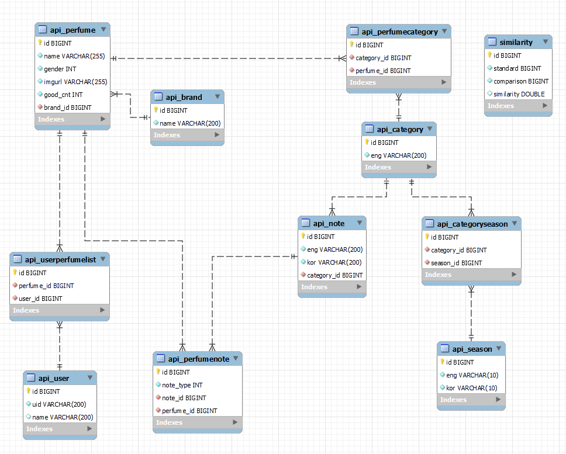

## 1. 배포 관련

### 1.1 FE 배포

1. docker image 생성

   ```bash
   docker build ./frontend -t frontend
   ```

2. docker container 생성

   ```bash
   docker run frontend
   ```

### 1.2 BE 배포

1. docker image 생성

   ```bash
   mvn clean package
   docker build ./backend/spring -t backend
   ```

2. docker container 생성

   ```
   docker run backend
   ```


## 2. 외부 서비스 정보

### 2.1 카카오 로그인/로그아웃

-  카카오 API를 이용한 사용자 인증 서비스 구현

### 2.2 AWS RDS

- AWS RDS 를 이용한 DB 배포(21.10.07 종료 예정)


## 3. 데이터베이스

### 3.1 ERD

